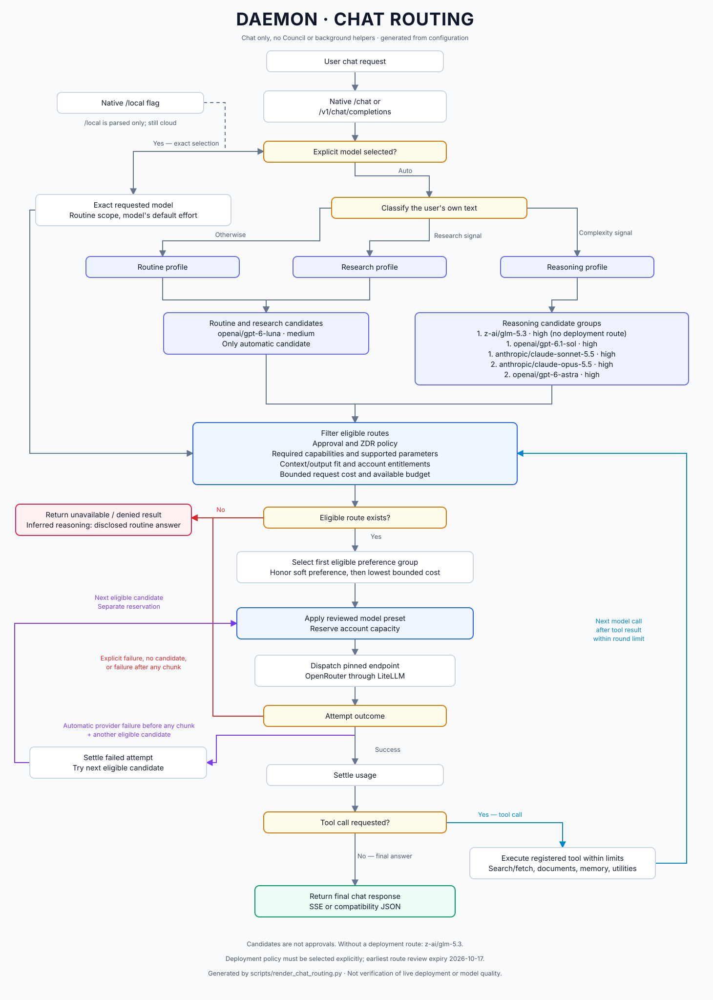
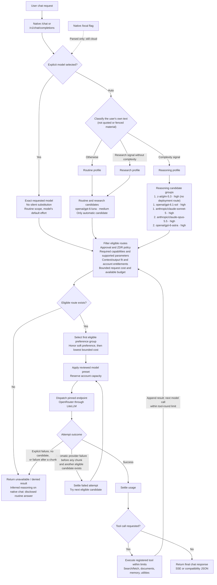

# Current chat routing

This describes ordinary chat only, excluding deliberation and background helper
workflows. It is not verification of the live deployment or model quality.

The diagram, the candidate table and the notes between the generated markers below
are produced by `scripts/render_chat_routing.py` from `config/model_routing.json`
and `config/inference_policy.production.json`, together with
[`CHAT_ROUTING.svg`](CHAT_ROUTING.svg). `tests/test_chat_routing_doc.py` fails when
they are stale, so any change to routing models, groups, presets or deployment
routes must regenerate them:

```bash
PYTHONPATH=. uv run python scripts/render_chat_routing.py
```

Edit the prose outside the markers by hand; edit the generated part through the
script.

<!-- BEGIN GENERATED: chat-routing (scripts/render_chat_routing.py) -->

## Rendered diagram



## Mermaid source



## Configured chat candidates

| Profile | Group | Candidate | Effort | Deployment route | Review expires |
| --- | --- | --- | --- | --- | --- |
| routine | 1. luna | `openai/gpt-6-luna` | medium | routine | 2026-10-06 |
| research | 1. luna | `openai/gpt-6-luna` | medium | routine | 2026-10-06 |
| reasoning | 1. demanding | `z-ai/glm-5.3` | high | none | — |
| reasoning | 1. demanding | `openai/gpt-6.1-sol` | high | premium | 2026-10-06 |
| reasoning | 1. demanding | `anthropic/claude-sonnet-5` | high | premium | 2026-10-06 |
| reasoning | 2. escalation | `anthropic/claude-opus-5.5` | high | premium | 2026-10-06 |
| reasoning | 2. escalation | `openai/gpt-6-astra` | high | premium | 2026-10-06 |

- Within a group, the lowest bounded cost for the request is tried first; list order is not priority.
- Effort is the preset applied after selection (`default`, overlaid by the profile's own preset).
- Candidates without a deployment route are filtered out at dispatch: `z-ai/glm-5.3`.
- The earliest operator review expiry among these deployment routes is 2026-10-06; an expired route fails closed.
- A route listed here is configuration, not proof of live availability or model quality.

<!-- END GENERATED: chat-routing -->

## Routing boundaries

- Classification reads the user's own text in the latest turn. Closed fenced
  blocks are pasted data; blockquotes count only when nothing else remains; the
  server's default text for an upload with no message is never classified. A code
  block on its own does not select reasoning. Complexity signals take precedence
  over research signals. Prompt length and conversation length alone do not select
  the reasoning profile. Signals are English-only.
- Routine and research are independent profiles. Each has only the automatic
  candidates listed for it, and neither falls back to a model outside its own
  groups.
- Reasoning walks ordered eligible candidates, including later groups when earlier
  candidates cannot serve or fail. This is not an answer-quality judge deciding to
  escalate.
- An explicit selection is exact and runs under the routine scope on both
  endpoints, so it receives that model's default effort whatever the wording. It
  bypasses the automatic shortlist, not qualification, capability, parameter,
  entitlement, context or budget checks.
- On native chat, an inferred reasoning request refused for missing premium routing
  or budget is answered on the routine profile with a disclosure (routing event
  `fallback`, a notice under the reply), and the turn stays on routine. Explicit
  selections, the compatibility endpoint, provider outages and background work keep
  the refusal (`capability_unavailable` for a missing capability, not retryable).
- Each inference attempt reserves capacity separately. Failure or unknown usage
  does not make an attempt free. Automatic streaming fallback stops once any
  upstream chunk has been emitted.
- Tool-loop calls share the account scope and workload requirements. Registered
  tools have their own availability and permission checks; being listed here is
  not a blanket grant. Spawn tools are not advertised, and retained spawn dispatch
  is denied. Ordinary research uses direct search/fetch instead of a research agent.
- This diagram omits mock execution, admission/persistence details and helper calls
  initiated by tools. Native chat and the compatibility API have different admission
  plumbing but share the guarded compute path.

## Configuration versus availability

The portable policy in `config/inference_policy.json` approves no inference routes.
The deployment policy must be selected explicitly through `DAEMON_INFERENCE_POLICY`.
A candidate's presence, or a deployment route listed above, is not approval at any
given moment or proof of live availability: each route also has to be within its
operator review period.

## Sources of truth

- Classification: [`orchestrator/model_router.py`](../orchestrator/model_router.py),
  `classify_message` and `select_model_tier`.
- Cloud/local intent parsing: [`orchestrator/router.py`](../orchestrator/router.py),
  `route_message`.
- Candidates and effort presets: [`config/model_routing.json`](../config/model_routing.json).
- Entry points and account scope: [`orchestrator/main.py`](../orchestrator/main.py).
- Qualification, selection, reservations and fallback:
  [`orchestrator/compute_runtime.py`](../orchestrator/compute_runtime.py),
  `_priced_candidates` and `guarded_completion`.
- Chat tool loop: [`orchestrator/daemon.py`](../orchestrator/daemon.py) and
  [`orchestrator/tools/builtin.py`](../orchestrator/tools/builtin.py).
- Portable policy: [`config/inference_policy.json`](../config/inference_policy.json).
- Deployment policy: [`config/inference_policy.production.json`](../config/inference_policy.production.json).
- Generator: [`scripts/render_chat_routing.py`](../scripts/render_chat_routing.py).
