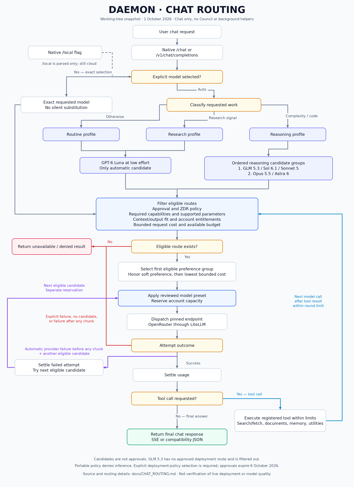
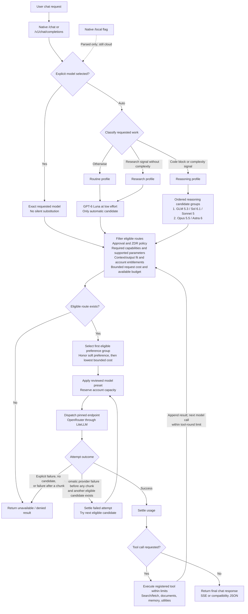

# Current chat routing

Snapshot: **1 October 2026**, based on the current working tree. This describes
ordinary chat only, excluding deliberation and background helper workflows.
It is not verification of the live deployment or model quality.

Maintenance: adopted on 1 October 2026. A-PR5 of the
[repair plan](REASONING_ROUTING_REPAIR_PLAN.md) makes this chart generated from
configuration and test-gated, so it updates when models change. Until then, update it
by hand in any PR that changes routing models, groups, presets or route approvals.
Within a candidate group, the lowest bounded cost is tried first; list order is not
priority.

## Rendered diagram

[View or download the PNG](CHAT_ROUTING.png).

## Mermaid source

## Routing boundaries

- Complexity signals take precedence over research signals. Prompt length and
  conversation length alone do not select the reasoning profile.
- Routine and research each have Luna as their sole automatic candidate; neither
  has an automatic alternate-model fallback.
- Reasoning walks ordered eligible candidates, including the later escalation
  group when earlier candidates cannot serve or fail. This is not an answer-quality
  judge deciding to escalate. All reasoning candidates currently use high effort.
- Explicit selection bypasses the automatic model shortlist, not qualification,
  capability, parameter, entitlement, context or budget checks.
- Each inference attempt reserves capacity separately. Failure or unknown usage
  does not make an attempt free. Automatic streaming fallback stops once any
  upstream chunk has been emitted.
- Tool-loop calls share the account scope and workload requirements. Registered
  tools have their own availability and permission checks; being listed here is
  not a blanket grant. Spawn tools are not advertised, and retained spawn dispatch
  is denied. Ordinary research uses direct search/fetch instead of a research agent.
- This diagram omits mock execution, admission/persistence details and helper calls
  initiated by tools. Native chat and the compatibility API have different admission
  plumbing but share the guarded compute path.

## Configuration versus availability

The portable policy in `config/inference_policy.json` approves no inference routes.
The deployment policy must be selected explicitly through `DAEMON_INFERENCE_POLICY`;
its current inference approvals expire on **6 October 2026**. GLM 5.3 is a reasoning
candidate but has no approved route in that deployment policy, so it is filtered
out. A candidate's presence is not approval or proof of live availability.

## Sources of truth

- Classification: [`orchestrator/model_router.py`](../orchestrator/model_router.py),
  `classify_message` and `select_model_tier`.
- Cloud/local intent parsing: [`orchestrator/router.py`](../orchestrator/router.py),
  `route_message`.
- Candidates and effort presets: [`config/model_routing.json`](../config/model_routing.json).
- Entry points and account scope: [`orchestrator/main.py`](../orchestrator/main.py).
- Qualification, selection, reservations and fallback:
  [`orchestrator/compute_runtime.py`](../orchestrator/compute_runtime.py),
  `_priced_candidates` and `guarded_completion`.
- Chat tool loop: [`orchestrator/daemon.py`](../orchestrator/daemon.py) and
  [`orchestrator/tools/builtin.py`](../orchestrator/tools/builtin.py).
- Portable policy: [`config/inference_policy.json`](../config/inference_policy.json).
- Deployment policy: [`config/inference_policy.production.json`](../config/inference_policy.production.json).
