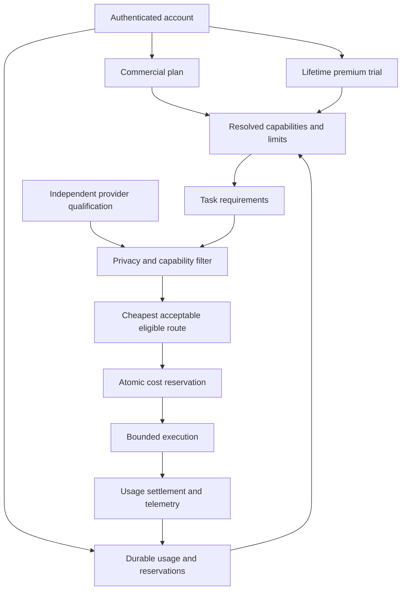

# Account entitlements and compute policy

## Product contract

Free answers things. Pro gets things done. Power handles workloads.

The durable commercial plans are **Free**, **Pro**, and **Power**. Privacy,
persistent memory, conversation continuity, and account/device functionality are
core product properties, not paid entitlements. Paid plans buy greater capacity
and access to expensive workloads; they do not buy unlimited inference.

A premium trial is a finite, usage-based grant on an account whose base plan is
Free. It has no calendar countdown. Consuming it must not change the plan, delete
memory, or disable ordinary Free interaction. Commercial numbers are development
defaults until separately approved for launch.

## Pre-implementation inventory

The September 2026 working-tree audit found these legacy surfaces:

| Surface | Existing implementation | Replacement disposition |
| --- | --- | --- |
| Commercial configuration | `orchestrator/config.py`: deployment-wide `DEFAULT_TIER`, five model-slot families, inline prices | Remove; separate workload configuration from account policy |
| Account schema | `users.id` is the authenticated account key; no subscription or trial columns | Add account-owned policy and durable usage state; preserve existing user IDs |
| Identity | Hosted identity creates users and personal tenants; legacy singleton also exists | Keep identity and data ownership; never infer plan from email or a client claim |
| Billing | No Stripe/Paddle SDK, checkout, portal, subscription table, or webhook | No external changes; provide a trusted idempotent import/update boundary |
| Chat | Global tier selects models; explicit model/provider selection exists | Resolve authenticated account capabilities and qualify every route server-side |
| Video | `main.py` passes a singleton billing user; credits API accepts a tier query | Use authenticated ownership and capability checks |
| Video accounting | `db/video_credits.py`, migrations 017/018: atomic prepaid debit/refund | Preserve balances/history independently of plan migration |
| Client gates | Studio `daemon_tier`, `X-Daemon-Tier`; account widget defaults to Pro | Remove client authority; fetch account policy |
| Trials/quotas | No premium trial or general compute ledger | Add lifetime grant and atomic bounded accounting |
| Existing budgets | Advisor/conversation and memory token budgets | Retain workload safety bounds; these are not commercial plans |
| Inference | Chat, tools, council, memory jobs call inference independently | Shared privacy and accounting enforcement; no unaccounted fallback |
| Telemetry | Chat tokens and council costs are partial | Durable account/plan/operation/model usage and limit records |
| Jobs | Memory/title/cleanup/evaluation; no billing jobs | Account provenance must survive background dispatch |
| Tests | Config/video pricing, credits/auth scoping; frontend logout and bridge tests | Replace tier expectations and test privacy, accounting, trials, ownership |
| Docs/deployment | Tier tables in context/specs, historical roadmap material and env comments | Update current authority; historical reports are not runtime policy |

The memory system's L0/L1/L2 **memory tiers** and classifier quality levels are
unrelated to subscriptions and must not be renamed as commercial plans.

## Migration and billing risks

There is no repository-backed list of existing paying subscribers. It would be
incorrect to promote every user because a deployment had `DEFAULT_TIER=pro`.
Existing users retain their IDs, memory, conversations, devices, and prepaid video
credits. External subscriber records, if maintained elsewhere, require a verified
account-ID import before paid access can be asserted. Legacy commercial names map
deterministically: Starter → Pro, Pro → Pro, Max → Power, Free → Free; BYOK is a
credential funding mode rather than a fourth plan.

An eventual billing adapter must verify provider events, map configured price IDs
to plans, reject stale updates, and deduplicate event IDs. The billing provider
remains authoritative for subscription status. Client metadata, local storage,
request headers, and settings are never sources of commercial authority. This
migration does not cancel subscriptions, create products, or call billing APIs.

The legacy-name map is isolated to explicit trusted imports, not request routing.
Its deletion condition is completion and reconciliation of all externally managed
legacy subscriber imports, after which callers must submit Free/Pro/Power directly.
There are no legacy subscription columns to keep synchronized in this database.

## Implementation sequence

1. Introduce centralized policy, provider qualification, account state, and atomic
   reservations with focused tests.
2. Replace runtime tier selection and enforce policy across interactive and
   background execution; preserve minimal retrieval-based memory disclosure.
3. Replace frontend tier guesses with authenticated policy and honest capacity
   messaging.
4. Remove obsolete configuration and checks, validate migration/usage behavior,
   and review the combined changes.



## Privacy invariants

Free Daemon gets cheaper and more constrained compute, not cheaper privacy.
Zero price is not evidence of provider qualification. Routes require explicit
approval, ZDR, no training or retention, the required request policy flags, and
compatible model capabilities. Unknown qualification or unavailable policy fails
closed. Premium routes follow the same rules. Approval must be re-evaluated when
provider terms, routing endpoints, pricing, or availability change.

ZDR never authorizes wholesale memory disclosure. Existing account scoping,
encryption, relevant-memory retrieval and bounded context assembly remain
required before a provider sees context. Credentials supplied in a future BYOK
mode cannot bypass privacy or runtime limits.

## Accounting contract

Internal monetary amounts are integer USD millionths (microusd), independent of
the display-price currency. Every plan has a recurring funded allowance; Free's
routine fallback allowance remains available after its separate lifetime premium
trial is consumed. The configured period is a UTC calendar month. Routine work
uses the recurring pool; premium trial work uses lifetime counters. Buying a paid
plan does not refill or discard the remaining trial allocation.
The grant is stored when the account's entitlement record is first initialized;
changing development trial defaults must not silently refill existing accounts.

Before outbound execution, reserve a conservative maximum cost under an account
row lock. Include open reservations when admitting concurrent work. Each
reservation belongs to its original period, even when it settles after rollover.
Use validated usage and centralized prices for successful settlement; when usage
is unknown after cancellation or failure, retain the conservative charge rather
than assume the provider did no work. A zero-cost route still consumes rate and
concurrency capacity, but must remain admissible after the funded balance reaches
zero. Clients cannot submit their own authoritative cost, plan, or allowance.
An expired hold left by a killed process is recovered at its full reserved cost,
not refunded as though no work happened. Recovery must use a cutoff beyond the
enforced whole-call deadline, including stream consumption. A reported cost above
the reserved quote closes the hold truthfully and suspends further execution for
operator reconciliation; spare monthly capacity must not hide a broken quote.
The quote's input side is priced at one token per UTF-8 byte plus per-message
framing, which byte-level tokenizers cannot exceed; a separate ~3-bytes-per-token
estimate only sizes the context window and output budget. After reconciling,
an operator reinstates the account with `scripts/entitlements_reinstate.py`.

Concurrency counts operations, not provider calls: reservations made inside one
account compute scope (a chat turn's tool loop, a council's parallel roles) share
one slot while any of them is open. Worker jobs (titles, summaries, extraction,
evaluation, consolidation) are charged to the account but take no rate or
concurrency slot, so background work never refuses the user's next message.
Every call of an extended run is charged to the extended-agent budget; only the
first takes an extended-run slot.

The durable ledger records the plan at admission, operation, model/provider/route,
reserved and settled cost, usage counters, and trial funding. Limit encounters
record reason codes rather than message contents. These support active-account
counts, cost per active account, heavy-tail usage, premium utilization, trial
consumption, and conversion-relevant capacity encounters without a separate
analytics platform. Cost figures derived from token prices or conservative holds
are estimates, not payment-provider invoices. No prompts or memory contents belong
in accounting metadata.

### Source locations and operating interfaces

| Concern | Authority |
| --- | --- |
| Plan prices, recurring budgets, capabilities and limits | `config/commercial.json` |
| Lifetime trial allocation and capability overlay | `trial` in `config/commercial.json` |
| Approved inference endpoints, prices, availability and privacy requirements | `config/inference_policy.json` |
| Resolution, reservation, settlement and trusted plan changes | `orchestrator/entitlements/` |
| Outbound inference enforcement and account execution scope | `orchestrator/compute_runtime.py` |
| Authenticated UI snapshot | `GET /users/me/entitlements` |
| Additive database migration | `migrations/039_entitlements_commercial.sql` |

The migration provides `v_entitlement_account_summary`,
`v_entitlement_period_activity`, `v_entitlement_trial_funnel`, and
`v_entitlement_limit_encounter_summary` for operator queries. Use reservation
provider/model labels for detailed model mix; do not join message content into
commercial reporting.

Trusted import code uses `EntitlementService.import_legacy_tier` with the verified
account UUID, legacy plan name, and a stable event ID. Subscription adapters use
`apply_subscription_event` after verifying provider authority. Replaying the same
event is idempotent; stale events must not overwrite newer state. Neither method
is exposed as a client-editable plan setting.

### Qualifying an OpenRouter route

Operator review is required before enabling a deployment's route. A model name,
`:free` suffix, or catalog listing cannot establish the provider's data policy.
Review the specific endpoint's terms and live policy metadata, record the evidence
and review expiry, and verify the OpenRouter account's prompt/completion logging
and separate free-model training settings. Do not enable the random `openrouter/free`
router as a shortcut for reviewed endpoint selection.

The outbound request must pin the reviewed provider and constrain routing:

```json
{
  "provider": {
    "only": ["reviewed-provider-slug"],
    "order": ["reviewed-provider-slug"],
    "allow_fallbacks": false,
    "require_parameters": true,
    "data_collection": "deny",
    "zdr": true,
    "max_price": {"prompt": 0, "completion": 0}
  }
}
```

The zero price ceilings above illustrate a genuinely free route; paid routes use
reviewed configured ceilings. OpenRouter prompt/completion price caps are USD per
million tokens. Budget reservations must cover the configured upper bound, not a
stale optimistic average. Provider-side fallback remains disabled; Daemon can
select another independently qualified route explicitly.

Public references (reviewed September 2026):
- [Provider selection and routing fields](https://openrouter.ai/docs/guides/routing/provider-selection)
- [Data collection controls](https://openrouter.ai/docs/guides/privacy/data-collection)
- [Provider logging policies](https://openrouter.ai/docs/guides/privacy/provider-logging)

### Adding a model or plan safely

For a new model, change the independent inference policy: qualification evidence,
endpoint identity, capabilities, availability, and conservative prices. Test
privacy exclusion, client-override rejection, unavailable-route fallback, and
maximum-cost reservation before enabling it. No commercial schema change should
be needed for a model rotation.
Each route must declare verified `model_capabilities` (for example `text`, `tools`,
or `json_schema`) and its `max_context_tokens` and `max_output_tokens`. Unknown
capabilities or zero limits do not qualify a route. Fit task requirements and
input/output bounds before comparing eligible route costs.

For a new commercial configuration, edit the centralized plan capabilities and
limits rather than execution branches. Validate all numbers, exercise upgrades,
downgrades, trial exhaustion, simultaneous requests, and rollover with outstanding
reservations. Changing display prices alone must not mutate billing-provider
products or subscription state. A genuinely new durable plan requires an explicit
product/schema migration and billing mapping; it is not an arbitrary client string.

## Rollout prerequisites

Policy eligibility is distinct from adapter availability. Image/video/audio and
other externally funded services must remain unavailable where an adapter cannot
bound and settle its cost. Adding an approval record alone does not implement such
an adapter, and retained video credits are not a promise that generation is
currently enabled. Likewise, an unavailable embedding service must not disable
core memory persistence: nullable embeddings and account-scoped lexical retrieval
provide the non-semantic path. Checkout, a payment portal, and a verified public
billing webhook remain separate integration work; the trusted subscription-event
interface is not a deployed billing flow.

- Deploy the schema migration before the new backend/worker processes, with an
  ordinary database backup and verified account-ID mapping for any externally
  managed subscribers. Do not run old tier-trusting workers alongside the new
  enforcement path after cutover.
- Distribute identical commercial and provider policies to backend and worker
  processes. Container images include `config/`; Compose's existing repository
  bind mount also supplies those files.
- Qualify at least one routine route and the required external services for the
  deployment. The repository does not certify a live provider account: empty or
  expired approvals intentionally produce safe capacity/unavailability errors.
- Reconcile existing paid accounts from authoritative records. A lack of local
  subscription records is not evidence that an externally subscribed user is Free.
  Preserve video-credit balances and histories during reconciliation.
- Exercise trial exhaustion, concurrent reservations, provider failure, and
  upgrade/downgrade in staging before traffic cutover. Verify retained conversation
  and memory access using the same account UUID.
- Run backend, frontend, feature-matrix, documentation, and secret-scanning gates.
  Pre-existing working-tree failures still block a clean release; they must not be
  hidden by loosening gates or regenerating type-check baselines.

External checkout, payment collection, signed billing webhooks, and customer
portal integration require a separate billing-provider adapter. A trusted internal
subscription update primitive is not a claim that these public billing flows exist.
